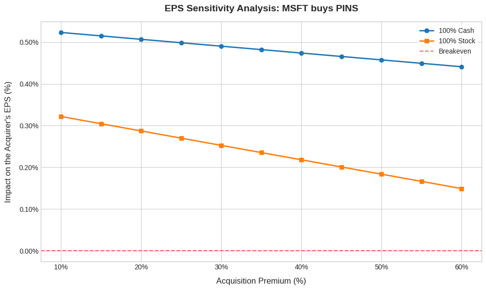

# M&A Accretion/Dilution Analysis Engine

An object-oriented Python framework designed to simulate and analyze mergers and acquisitions (M&A) transactions using real-world financial data.

The project automates key elements of a simplified M&A model commonly used in investment banking and corporate finance, including valuation metrics, acquisition premium analysis, financing structure comparisons, EPS accretion/dilution calculations, and sensitivity analysis.

---

## Project Overview

This project was developed as an educational exercise to bridge corporate finance concepts with software engineering practices.

It retrieves publicly available financial information through Yahoo Finance and builds a simplified transaction model capable of evaluating the potential impact of an acquisition under different financing assumptions.

The model focuses on answering questions such as:

- How much would an acquisition cost after applying a takeover premium?
- Is the transaction accretive or dilutive to the acquirer's earnings per share (EPS)?
- How does the financing method (cash vs. stock) affect the outcome?
- How sensitive are the results to different acquisition premiums?

---

## Features

### Company Financial Analysis

For each company involved in the transaction, the model automatically retrieves and computes:

- Market Capitalization
- Enterprise Value (EV)
- Revenue
- EBITDA
- Net Income
- Cash Position
- Debt Position
- EV / Revenue Multiple
- EV / EBITDA Multiple
- Price-to-Earnings Ratio (P/E)
- Standalone Earnings Per Share (EPS)

---

### M&A Transaction Modeling

The framework supports:

- Acquisition premium estimation;
- Equity purchase price calculation;
- Transaction Enterprise Value estimation;
- Expected post-merger synergies;
- 100% cash acquisition scenarios;
- 100% stock-for-stock acquisition scenarios;
- EPS accretion/dilution analysis.

---

### Sensitivity Analysis

The model generates sensitivity analyses showing how the acquirer's EPS changes under varying acquisition premiums.

The analysis compares:

- Cash-financed transactions;
- Stock-financed transactions.

Results are visualized through automatically generated charts.

---
### Example Output

The figure below illustrates how the acquisition premium affects the acquirer's EPS under different financing structures.



---
## Architecture

The project is structured around three main classes:

### `Company`

Responsible for retrieving and standardizing financial information for a single company.

Key responsibilities:

- Download financial statements;
- Retrieve market data;
- Compute standalone valuation metrics.

---

### `MA`

Represents the transaction model itself.

Key responsibilities:

- Estimate offer prices;
- Calculate purchase values;
- Incorporate synergies;
- Simulate financing structures;
- Evaluate EPS accretion/dilution.

---

### `FinancialVisualizer`

Dedicated to scenario visualization.

Key responsibilities:

- Perform premium sensitivity analyses;
- Generate publication-ready charts;
- Summarize EPS impacts under different assumptions.

---

## Example Workflow

```python
buyer = Company("MSFT")
target = Company("PINS")

deal = MA(
    buyer=buyer,
    target=target,
    premium_pct=0.30,
    synergies=300e6
)

cash_result = deal.analyze_cash_deal()
stock_result = deal.analyze_stock_deal()

visualizer = FinancialVisualizer(deal)
visualizer.plot_eps_sensitivity_analysis()
```

---

## Technologies Used

- Python
- Pandas
- NumPy
- Matplotlib
- Yahoo Finance (`yfinance`)

---

## Installation

Clone the repository:

```bash
git clone https://github.com/yourusername/ma-analysis-engine.git
cd ma-analysis-engine
```

Install the dependencies:

```bash
pip install -r requirements.txt
```

Run the example:

```bash
python main.py
```

---

## Important Disclaimer

This project is intended **exclusively for educational and demonstrative purposes**.

It should **not** be interpreted as:

- investment advice;
- financial advice;
- a recommendation to buy or sell securities;
- an indication of the author's views regarding any company involved.

The companies used in the examples are selected solely to demonstrate the mechanics of M&A analysis.

Although efforts were made to choose businesses belonging to reasonably related industries, **their inclusion does not imply that an actual transaction is expected, likely, or under consideration**.

All calculations are based on publicly available information and simplified modeling assumptions.

---

## Model Limitations

This framework intentionally simplifies several aspects of real-world M&A transactions.

The model does **not** include:

- Purchase Price Allocation (PPA);
- Fair value adjustments;
- D&A step-ups;
- Transaction fees and advisory costs;
- Integration costs;
- Tax optimization strategies;
- Complex financing structures;
- Regulatory considerations.

As a result, this project should be viewed as an **educational approximation of an accretion/dilution model**, rather than a substitute for professional financial analysis.

---

## Motivation

Traditional M&A modeling is predominantly performed in spreadsheet environments.

This project explores how core investment banking concepts can be translated into reusable, object-oriented Python code, improving automation, reproducibility, and scalability.

The goal was to combine:

- Corporate Finance;
- Financial Modeling;
- Data Analysis;
- Software Engineering principles.

---

## Author

Developed independently as part of a personal initiative to strengthen practical skills in financial modeling and Python programming.

Feedback and suggestions are always welcome.
